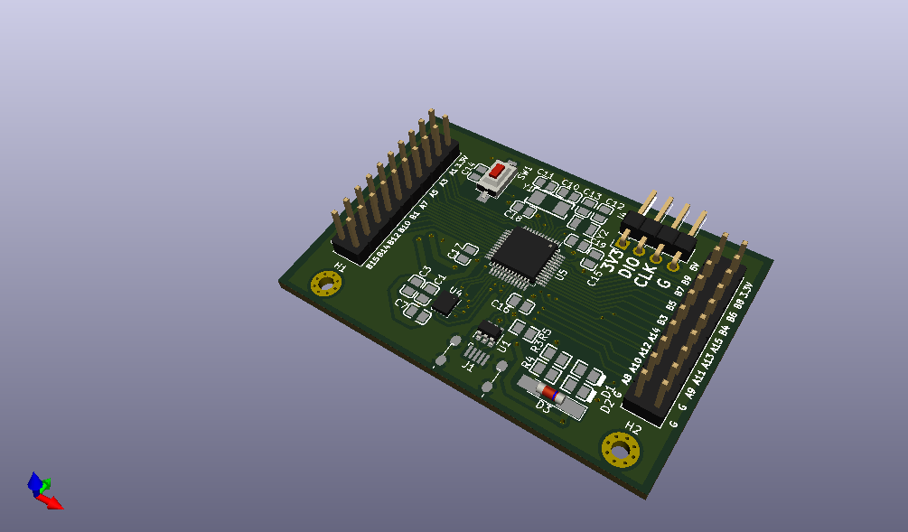

# STM32F302C8T6最小系统

这个硬件项目是用于取代原先F103C8T6开发板而制作的，也为其他硬件项目提供参考。相比于同等密度的F103，STM32F302拥有一个高速（5MSPS）ADC，并且额外增加了一个运放和三个比较器，适合模数混合的应用。另外由于其定时器带有输入时钟倍频的功能，其输出分辨率比F103更高。

板载功能除了必须的调试口，复位电路以及晶振电路之外，还引出了USB接口与两枚测试用的LED，另外还增加了一颗IMU（QMI8658C）的位置，用于实践测试IMU解算算法以及评估IMU性能。

最小系统板还配备了一块带有三个半桥驱动的底板（原来的目的是用于驱动电机，后面发现不符合要求），适合用于作为功率级使用。三个半桥均带有电流检测的功能。由核心板的5V经过升压达到11V输入驱动IC，而电流检测放大器的供电则由5V经线性稳压供电。

## 硬件说明

1. 最小系统板内主控的模拟电源与数字电源可分开供电，可以选择使用额外的LDO LP5907为模拟电源供电，或者拖锡连接JP1直接连接模数电源

2. AMS1117输入输出的二极管D3必须焊接，否则会出现在调试时只接入3.3V而1117发热严重的情况

3. IMU的中断管脚INT1与栅极驱动底板的驱动输入引脚有冲突，按照目前的设计二选其一使用

## 软件说明

`f302_minimal_test` 内为早期测试核心板的代码，基本没有实际用途

`imu_f302` 内为IMU测试解算代码，读取QMI8658C解算角度，并将其通过USB虚拟串口发送至匿名地面站上位机。EKF解算算法详见[这篇博客](https://sourcelizi.github.io/202304/imu-practice/)，新增加的ESKF解算算法见[这篇博客](https://sourcelizi.github.io/202311/imu-practice3/)